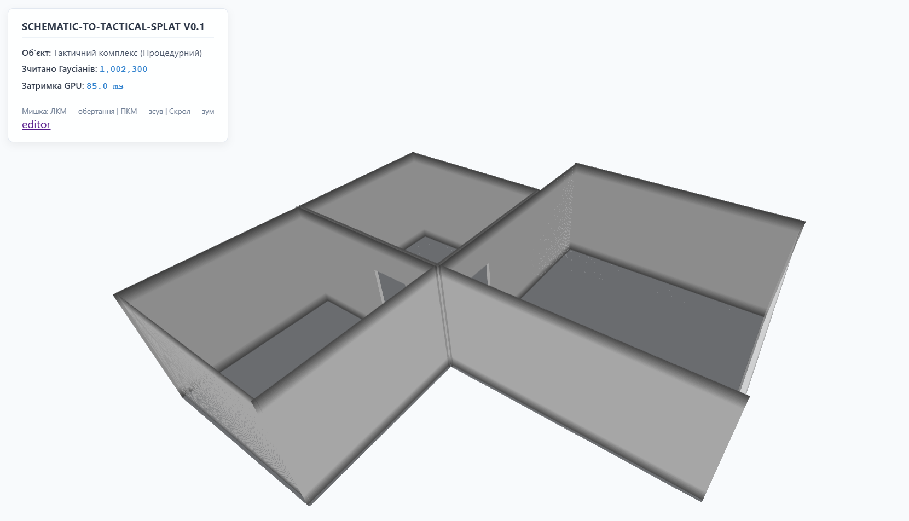
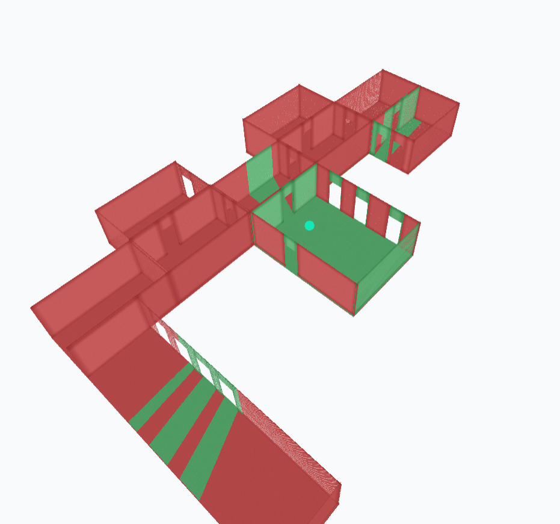

# Schematic-To-CQB v0.2

## Tactical Space Editor & Synthetic 3D Gaussian Splatting Engine

Schematic-To-CQB is an engineering and simulation pipeline designed to conceptualize, procedurally generate, and visualize complex multi-room tactical environments as highly dense **3D Gaussian Splatting (3DGS)** models.


| Schematic-To-CQB Overview | Schematic-To-CQB Editor Overview |
|:------------:|:------------------------:|
|  |  |

---

## 🚀 Key Features

- **PyTorch C++ Generation Core** 
  - Native C++ acceleration for high-performance scene generation.
  - Multi-room environment construction in milliseconds.
  - Automatic camera inner-offset generation (4 cm).
  - Ambient Occlusion computation for improved visual realism.

- **Moiré-Free WebGL2 Viewer**
  - Smooth exponential Gaussian blending (`e^{-d²}`) replacing binary fragment discards.
  - Floor geometry grid jittering to eliminate perspective aliasing.
  - Hardware-instanced rendering for interactive visualization.

- **Robust Tactical Layout Editor**
  - Accurate bounding-box interaction on high-DPI displays.
  - Shared-edge doorway routing graph.
  - Reliable multi-room topology generation.

- **Synthetic Camera Trajectory Generator**
  - Anti-aliased vectorization of flight paths.
  - Noise-reduced synthetic COLMAP camera databases.
  - Automated trajectory generation for photogrammetry simulation.

---

## 👁️ Tactical Line-of-Sight (LOS) Engine

A real-time tactical visibility analysis module that computes dead zones and fields of fire using an optimized 2D vector-based raycasting pipeline.

### Visualization



---

## 🛠️ Tech Stack

| Category | Technologies |
|----------|--------------|
| Language | Python 3.11, C++ |
| Backend | FastAPI |
| Deep Learning | PyTorch |
| Native Acceleration | Pybind11, `torch.utils.cpp_extension` |
| Rendering | WebGL2, Three.js, RawShaderMaterial |
| Frontend | HTML5 Canvas |
| Build Tools | MSVC / GCC |

---

## 📂 Project Structure

```text
AeroSplat-GIS/
├── setup.py
├── requirements.txt
├── src/
│   ├── server/
│   │   └── main.py
│   ├── cpp/
│   ├── renderer/
│   └── ...
├── web/
│   └── editor.html
└── assets/
    └── images/
        └── assets_01.png
```

---

# 📦 Installation

Install the required dependencies:

```bash
pip install torch fastapi uvicorn numpy pillow
```

---

# 🔨 Build Native Extension

Compile the high-performance C++ module.

## Windows (PowerShell)

Initialize the SDK flag:

```powershell
$env:DISTUTILS_USE_SDK=1
```

Build the extension:

```bash
python setup.py build_ext --inplace
```

## Linux / WSL

```bash
python setup.py build_ext --inplace
```

---

# 📁 Deploy Native Module

After compilation, move the generated native module:

- Windows → `.pyd`
- Linux → `.so`

from the project root into the `src/` directory.

---

# 💻 Running the Server

Start the backend:

```bash
python src/server/main.py
```

Open the editor in your browser:

```
http://127.0.0.1:8000/web/editor.html
```

---

# 📊 Pipeline Overview

The AeroSplat-GIS workflow consists of:

1. Tactical room layout creation
2. Procedural scene generation
3. Native C++ geometry expansion
4. Ambient Occlusion computation
5. Synthetic camera placement
6. Anti-aliased trajectory generation
7. Interactive WebGL2 rendering
8. Synthetic COLMAP export

---

# 🖥️ Visualization

The WebGL2 editor provides:

- Interactive tactical floor-plan editing
- Multi-room environment generation
- High-density Gaussian visualization
- Smooth hardware-instanced rendering
- Real-time camera trajectory preview
- Moiré-free rendering through exponential Gaussian blending

---

# ⚡ Performance Highlights

- Native C++ acceleration through Pybind11
- GPU-accelerated WebGL2 rendering
- High-performance PyTorch integration
- Interactive editing of complex indoor tactical environments
- Synthetic 3D Gaussian Splatting scene generation suitable for simulation, visualization, and research workflows.